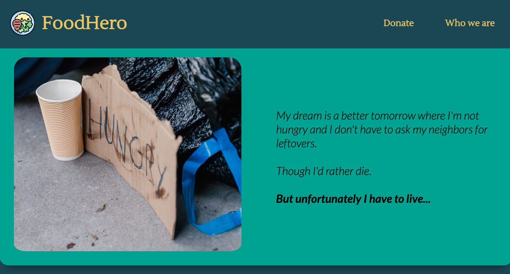

# FoodHero - Web App

Web App in Node.js and React.

## Table of contents
* [General info](#general-info)
* [Technologies](#technologies)
* [Setup](#setup)
* [Illustrations](#illustrations)
* [Features](#features)

## General info

## Technologies
* JavaScript
* React 18.2.0
* Library:
    * Slick 1.8.1
## Setup
In the project directory, you can run:

```
### `npm install`
### `npm start`
```

Runs the app in the development mode.\
Open [http://localhost:3000](http://localhost:3000) to view it in your browser.

## Illustrations


## Features:
* Send us your contact info via website
* Get basic info about our organisation
* Support our organisation financially


### To Do:
* Implement website responsiveness


